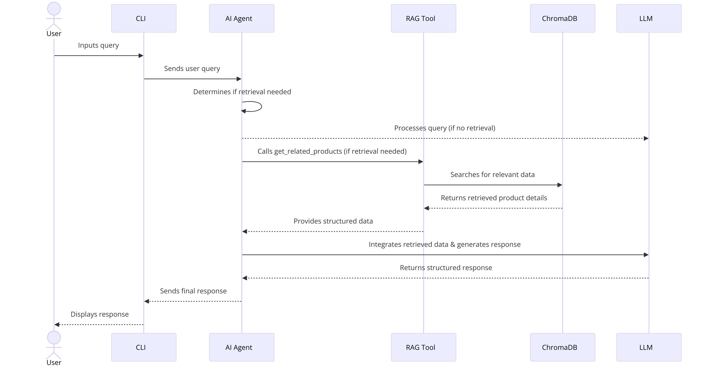
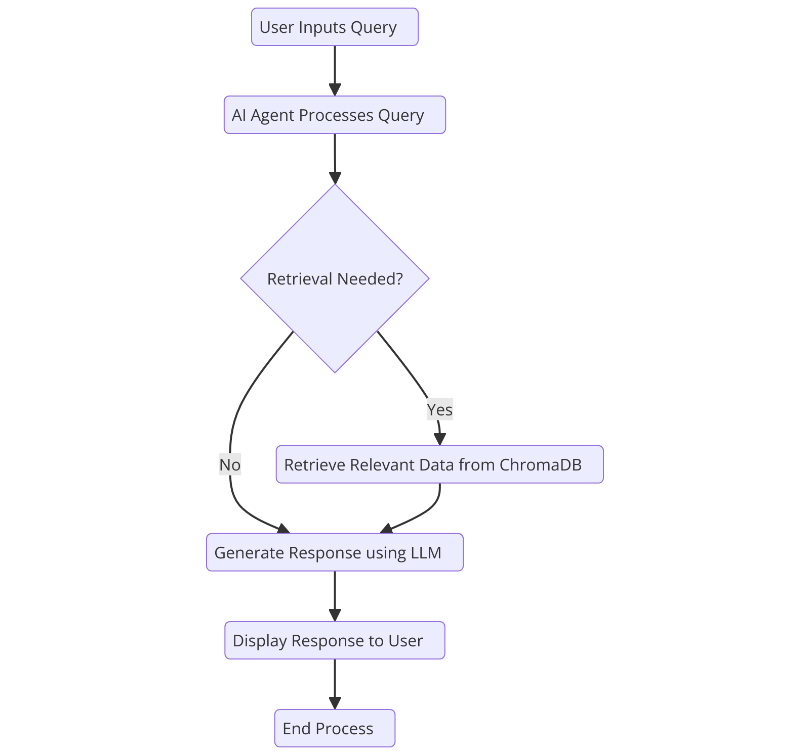
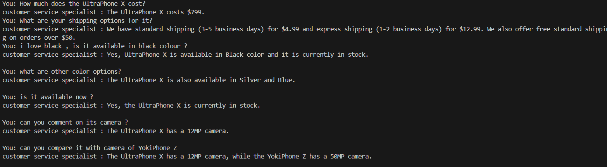
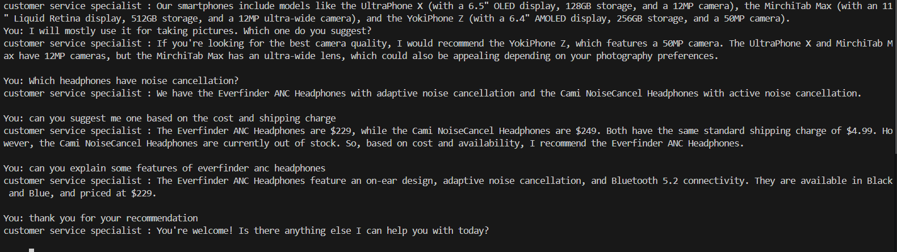
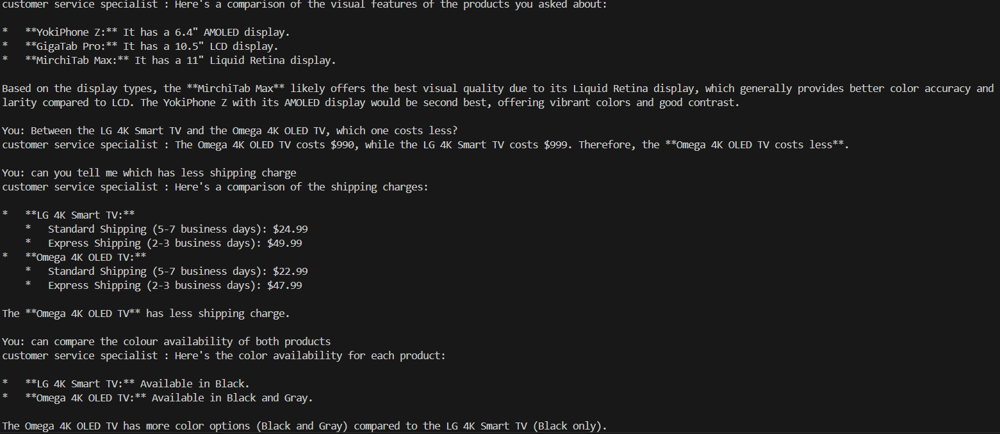

# AI Customer Support Agent

## Overview
The AI Customer Support Agent is designed to assist users by answering their inquiries about products and services. It leverages chat functionality to remember conversation history, enabling it to provide contextual and relevant responses. Additionally, it can answer general queries, such as product recommendations (e.g., "Which headphones have noise cancellation?").

## Features
- **Chat History Awareness**: Maintains context across interactions to handle follow-up questions effectively.
- **General Query Support**: Responds to common questions beyond customer support, including product recommendations and general inquiries.

## Architecture
### Overview:
The Customer Support AI Agent is designed to answer common e-commerce questions using a Retrieval-Augmented Generation (RAG) approach. It utilizes Gemini-2.0-Flash LLM with a RAG tool (get_related_products) that retrieves relevant product information from ChromaDB.

### Architecture Components:

1. **User Interaction Layer**

    - Command-line interface (CLI)

    - Users input questions regarding e-commerce products and policies.

2. **AI Agent (Gemini-2.0-Flash)**

    - Uses the Google python-genai package.

    - Processes user queries and determines whether retrieval from the knowledge base is required.

    - Calls get_related_products when necessary.

    - Generates responses based on retrieved information , history and LLM reasoning.

3. **Tool - get_related_products (RAG Component)**

    - Extracts relevant information from ChromaDB.

    - Receives structured product details, query type, and general question.

    - Returns the most relevant products details based on similarity search.

4. **Vector Database (ChromaDB)**

    - Stores product details as embeddings 

    - Uses cosine similarity for retrieval.

    - Updated with structured product data from product_data.json.

5. **Embedding Model (text-embedding-004)**

    - Generates embeddings for queries and stored product data.

    - Utilized during vector retrieval from ChromaDB.

6. **Response Generation & Delivery**

    - The LLM processes the retrieved data.

    - Generates a structured and user-friendly response.

    - Displays the response in the CLI.


## Sequence Diagram


## Flowchart


---
---
## Example Conversations


### 1. Context-Aware and product related Conversations
---

**You :** How much does the UltraPhone X cost?

**customer service specialist :** The UltraPhone X costs $799.

**User :** What are your shipping options for it?

**customer service specialist :** We have three shipping options for the UltraPhone X: Standard Shipping (3-5 business days) for $4.99, Express Shipping (1-2 business days) for $12.99, and free Standard Shipping on orders over $50.

**You :** i love black , is it available in black colour ?

**customer service specialist :** Yes, UltraPhone X is available in Black color and it is currently in stock.

**You :** what are other color options?

**customer service specialist :** The UltraPhone X is also available in Silver and Blue.

**You :** is it available now ? 

**customer service specialist :** Yes, the UltraPhone X is currently in stock.

**You :** can you comment on its camera ?

**customer service specialist :** The UltraPhone X has a 12MP camera.

**You :** can you compare it with camera of YokiPhone Z?

**customer service specialist :** The UltraPhone X has a 12MP camera, while the YokiPhone Z has a 50MP camera.



---
### 2. General Query related conversations
---

**You :** what are the features of your smart phones ?

**customer service specialist :** Our smartphones include models like the UltraPhone X (with a 6.5" OLED display, 128GB storage, and a 12MP camera), the MirchiTab Max (with an 11" Liquid Retina display, 512GB storage, and a 12MP ultra-wide camera), and the YokiPhone Z (with a 6.4" AMOLED display, 256GB storage, and a 50MP camera).

**You :** I will mostly use it for taking pictures. Which one do you suggest?

**customer service specialist :** If you're looking for the best camera quality, I would recommend the YokiPhone Z, which features a 50MP camera. The UltraPhone X and MirchiTab Max have 12MP cameras, but the MirchiTab Max has an ultra-wide lens, which could also be appealing depending on your photography preferences.

**You :** Which headphones have noise cancellation?

**customer service specialist :** We have the Everfinder ANC Headphones with adaptive noise cancellation and the Cami NoiseCancel Headphones with active noise cancellation.

**You :** can you suggest me one based on the cost and shipping charge

**customer service specialist :** The Everfinder ANC Headphones are $229, while the Cami NoiseCancel Headphones are $249. Both have the same standard shipping charge of $4.99. However, the Cami NoiseCancel Headphones are currently out of stock. So, based on cost and availability, I recommend the Everfinder ANC Headphones.

**You :** can you explain some features of everfinder anc headphones

**customer service specialist :** The Everfinder ANC Headphones feature an on-ear design, adaptive noise cancellation, and Bluetooth 5.2 connectivity. They are available in Black and Blue, and priced at $229.

**You :** thank you for your recommendation

**customer service specialist :** You're welcome! Is there anything else I can help you with today?




---

### 3. Multiple products - conversations

---

**You :** Can you compare the features of the YokiPhone Z , GigaTab Pro, and MirchiTab Max and suggest which one has better visual quality?

**customer service specialist :** Here's a comparison of the visual features of the products you asked about:

*   YokiPhone Z: It has a 6.4" AMOLED display.
*   GigaTab Pro: It has a 10.5" LCD display.
*   MirchiTab Max: It has a 11" Liquid Retina display.

Based on the display types, the MirchiTab Max likely offers the best visual quality due to its Liquid Retina display, which generally provides better color accuracy and clarity compared to LCD. The YokiPhone Z with its AMOLED display would be second best, offering vibrant colors and good contrast.


**You :** Between the LG 4K Smart TV and the Omega 4K OLED TV, which one costs less?


**customer service specialist :** The Omega 4K OLED TV costs $990, while the LG 4K Smart TV costs $999. Therefore, the Omega 4K OLED TV costs less.

**You :**  can you tell me which has less shipping charge

**customer service specialist :** Here's a comparison of the shipping charges:
    *   LG 4K Smart TV:
        *   Standard Shipping (5-7 business days): $24.99
        *   Express Shipping (2-3 business days): $49.99
    *   Omega 4K OLED TV:
        *   Standard Shipping (5-7 business days): $22.99
        *   Express Shipping (2-3 business days): $47.99
The Omega 4K OLED TV has less shipping charge.


**You :** can compare the colour availability of both products


**customer service specialist :** Here's the color availability for each product:

*   LG 4K Smart TV: Available in Black.
*   Omega 4K OLED TV: Available in Black and Gray.

The Omega 4K OLED TV has more color options (Black and Gray) compared to the LG 4K Smart TV (Black only).

**You :** based on features which do you prefer

**customer service specialist :** Here's a comparison of the features to help you decide:

*   LG 4K Smart TV: 55" 4K UHD display, HDR10+, Built-in streaming apps
*   Omega 4K OLED TV: 50" 4K OLED display, Dolby Vision, AI-powered upscaling

My preference, based purely on the listed features, would be the Omega 4K OLED TV. Here's why:

*   OLED Technology: OLED generally offers superior picture quality with better contrast, black levels, and color accuracy compared to standard UHD displays.
*   Dolby Vision: Dolby Vision is a more advanced HDR format than HDR10+, potentially offering a better HDR experience.
*   AI-powered upscaling: This feature can improve the picture quality of non-4K content.

While the LG TV has a slightly larger screen (55" vs 50"), the improvements in picture quality from OLED, Dolby Vision, and AI-upscaling make the Omega TV more appealing. 


---


## Installation
1. Clone the repository:
   ```bash
   git clone git@github.com:swathyhealer/e_commerce_chatbot.git
   ```
2.  Install dependencies:
   ```bash
   pip install -r requirements.txt
   ```
3. Store API Key Securely:

    For Linux/macOS:
    
            export GEMINI_API_KEY="your_api_key_here"

    For Windows:
            
            $env:GEMINI_API_KEY="your_api_key_here"

4. Run the application:
   ```bash
   python app.py
   ```

## Usage
- Start the chat interface and ask product-related or general questions.
- Follow up on previous queries, and the agent will recall context.
- Ask about products or general recommendations.


## License
This project is licensed under the MIT License.

